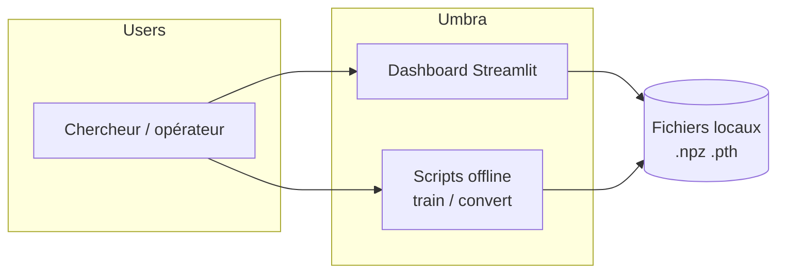
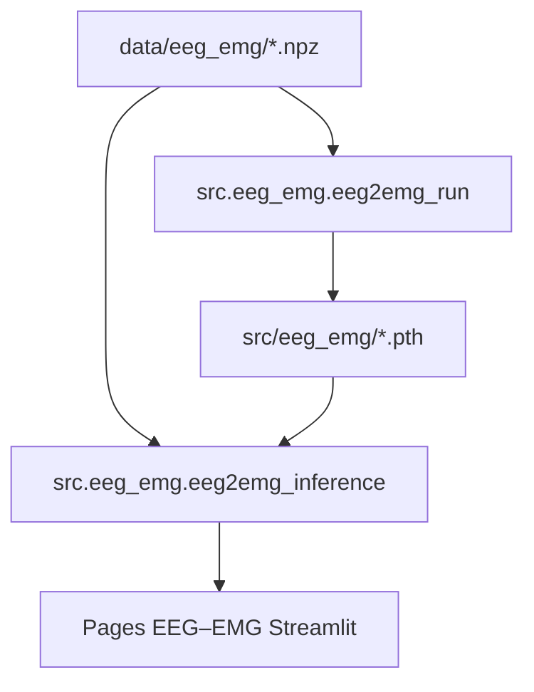

# Architecture technique — Umbra

Document de référence : **composants**, **flux de données**, **runtime** et **choix structurants**.

## 1. Contexte (C4 — niveau contexte)



## 2. Conteneurs et processus

| Conteneur | Rôle | Technologie |
|-----------|------|-------------|
| Dashboard | Exploration, inférence interactive, rapports JSON | Streamlit, pages sous `src/dashboard/eeg_emg/` |
| Pipeline EEG→EMG | Fenêtrage, entraînement, inférence CNN–LSTM | Python, PyTorch |
| CI | Lint, types, tests, couverture, audit dépendances, SonarCloud | GitHub Actions |

## 3. Composants

```
src/
├── config.py              # Constantes chemins EEG→EMG
├── eeg_emg/               # NPZ → dataset fenêtré → modèle PyTorch + inférence
└── dashboard/
    ├── app.py             # Point d’entrée multipage
    ├── eeg_emg/           # Pages Streamlit (décodeur, qualité, comparateur, hardware)
    └── eeg_emg_*.py       # Utilitaires partagés (qualité, comparateur, profilage)
```

- **Pas de base de données** : état dans fichiers et rapports JSON sous `data/eeg_emg_*_reports/`.

## 4. Flux de données — EEG → EMG



## 5. Déploiement et runtime

| Mode | Commande | Port | GPU |
|------|----------|------|-----|
| Local | `streamlit run src/dashboard/app.py` | 8501 | Optionnel (PyTorch) |
| Docker | `docker compose up --build` | 8501 | `--gpus all` si image GPU adaptée |
| CI | Workflows `.github/workflows/` | — | CPU |

Volumes typiques : montage **lecture seule** de `data/` et `src/eeg_emg/` pour checkpoints.

## 6. Versioning

- **Paquet** : version sémantique dans `pyproject.toml`.
- **Artefacts ML** : checkpoints et jeux de données documentés par nom de fichier ou rapport JSON.
- **Historique produit** : `CHANGELOG.md`.

## 7. Choix structurants

| Choix | Rationale |
|-------|-----------|
| PyTorch pour EEG→EMG | Flexibilité pour la recherche sur fenêtrage, métriques et profilage latence. |
| Streamlit | Prototypage rapide d’outils internes (voir `docs/security-and-operations.md`). |
| Fichiers + JSON | Simplicité, traçabilité des rapports sans infra DB. |

## 8. Documentation associée

- Cas d’usage techniques : `docs/use-cases-technical.md`
- Logique métier (fenêtres, métriques) : `docs/domain-logic.md`
- Index des docs : `docs/README.md`
